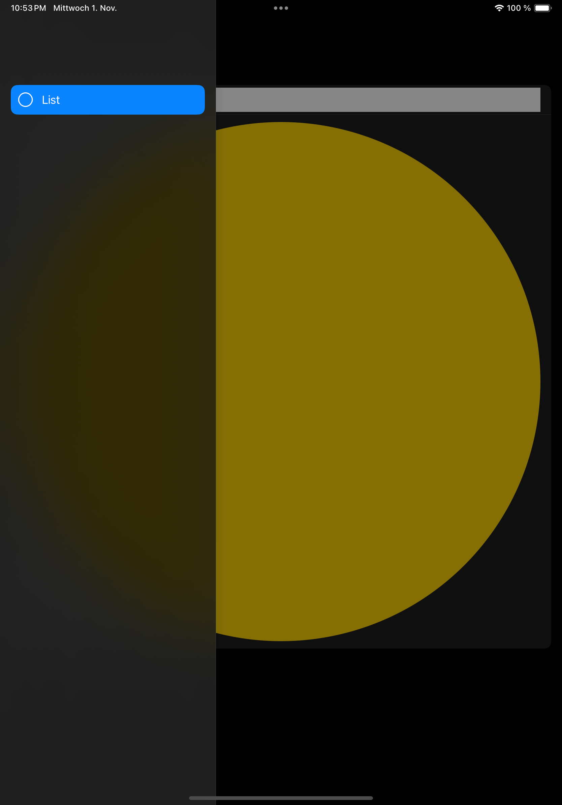

#  FB13324686 - SwiftUI: NavigationSplitView sidebar in overlay does not use Material as background

## Scenario

An app has a NavigationSplitView with a sidebar and detail view. The app is in compact layout showing the detail view and overlays the sidebar on tap of the sidebar button. 

## The Issue

Setting the sidebar background to a Material like .ultraThinMaterial or .ultraThickMaterial does not influence the see-through-ness of the sidebar. 

## Example Code

The example contains a NavigationSplitView. The Sidebar has `.background(.ultraThickMaterial)`. The app on an iPad Pro 11" in Portrait does show the sidebar as overlay over the content, but the background material is not used. 

## Tested on 

- iPadOS 17.0
